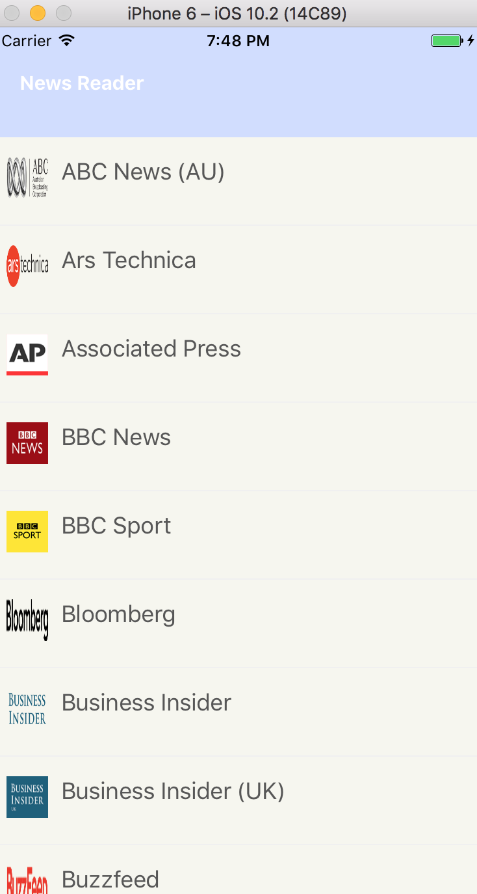
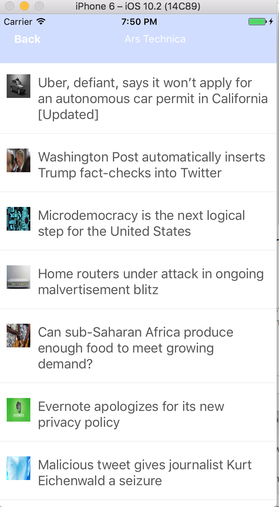

# News Reader
--

Uses React Native (0.39), tested on iOS and News API.

The app have two primary screens:

1) A list of news sources, presented however you wish (ideally, with an image and the name of the source)

2) A list of articles from a particular source, to be displayed when the user taps on a particular source. Again, the articles can be displayed however you'd like, but it would be great to include at least a thumbnail image and the title of the article.

Has offline support. Offline support means that if any data has been successfully fetched and displayed in the past, it should still be available even if the device has no active internet connection. We can test this by launching the app, fetching some data, killing the app, activating airplane mode in on the device, and verifying that news sources and articles are still displayed.

> Uses Navigator to switch between scenes and AsyncStorage for keeping the data offline

## iOS
Info.plist has been changed, to enabled other domains - "App Transport Security Settings"
has been modified

--
Gil Tamari
